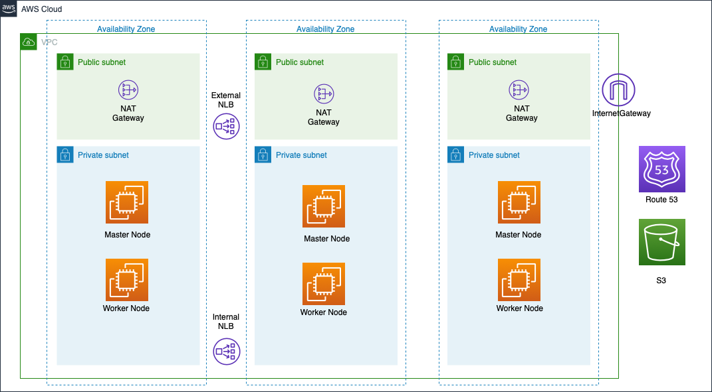

# AWS ROSA

### Architecture


### Enable ROSA
* Enable ROSA [here](https://console.aws.amazon.com/rosa/home)
* Get RedHat ROSA token [here](https://cloud.redhat.com/openshift/token/rosa)
* Your account must have a service-linked role set up as it is required for Elastic Load Balancing (ELB) to be configured.This is applicable if you have not created a load balancer in your AWS account previously. Please follow [here](https://docs.openshift.com/rosa/sd_support/rosa-troubleshooting-deployments.html#rosa-troubleshooting-elb-service-role_rosa-troubleshooting-cluster-deployments) to create the ELB service-linked role:


### Prerequisites
* Following modules are required to be installed as prerequisites:
  * Terraform 
  * wget
  * htpasswd
  * python3
  * AWS CLI
  * jq
  * podman
  * Openshift CLI
  * helm
 
* Alternatively run the below scripts to install all prerequisites:
  * For RHEL:
  ```bash
  ./linux-prereq-install.sh
  ```

  * For Mac:
  ```bash
  ./mac-prereq-install.sh
  ```
  
### Steps to Deploy:
* AWS `Access key ID` and `Secret access key` will be required for the deployment. An user with below policy is required for the IAM user which will be used for deploying the cluster.
```
{
    "Version": "2012-10-17",
    "Statement": [
        {
            "Sid": "VisualEditor0",
            "Effect": "Allow",
            "Action": [
                "elasticfilesystem:*",
                "servicequotas:ListServices",
                "aws-marketplace:ViewSubscriptions",
                "aws-marketplace:Unsubscribe",
                "s3:*",
                "logs:*",
                "cloudtrail:*",
                "fsx:*",
                "sts:*",
                "aws-marketplace:Subscribe",
                "elasticloadbalancing:*",
                "servicequotas:GetRequestedServiceQuotaChange",
                "servicequotas:GetServiceQuota",
                "autoscaling:*",
                "support:*",
                "servicequotas:RequestServiceQuotaIncrease",
                "iam:*",
                "cloudwatch:*",
                "kms:*",
                "route53:*",
                "ec2:*",
                "tag:*",
                "servicequotas:ListServiceQuotas"
            ],
            "Resource": "*"
        }
    ]
}
```
* Before deploying the infrastructure make sure you have `python3` installed in your local machine.
* [Sign up](https://www.ibm.com/account/reg/us-en/signup?formid=urx-42212) for a Cloud Pak for Data Trial Key if you don't have the API key.
* Clone this repository:
```bash
git clone <repo_url>
```
* Change the current directory to `aws/terraform/`:
```
cd cp4d-deployment/managed-openshift/aws/terraform/
```
* Read the license [here](https://www14.software.ibm.com/cgi-bin/weblap/lap.pl?li_formnum=L-DNAA-BZTPEW) and accept it by setting variable `accept_cpd_license` to `accept`.
* You can use the `cpd-1az-new-vpc.tfvars` file in this folder with preset values for a cluster with CPD plaform on EFS as File storage and EBS as Block storage on a new VPC cluster. Note that the `<required>` parameters need to be set. You can also choose to install additional services on the CPD platform as per your requirements, by flipping the respective variable to yes. For example for installing Watson Knowledge Catalog service, change 
```
watson_knowledge_catalog  =  "no"  -->   watson_knowledge_catalog  =  "yes"
```
* To set up efs or netapp fsx file systems , enable the respective variables
For efs : ```efs = { "enable" : "true" }```
For fsx:  ```fsx  = { "enable" : "true" }```

* The storage class to be used by cloud pak for data services is passed using storage_option variable:
```storage_option = "efs-ebs"```


| Storage_option | File Storage Class | Block Storage Class |
| ------------- | ------------- | ------------- |
| efs-ebs  | efs-nfs-client | gp3-csi  |
| efs  | efs-nfs-client  | efs-nfs-client  |
| fsx | ontap-nas | ontap-nas  |

If you are using the `cpd-1az-new-vpc.tfvars` file

```bash
terraform init
terraform apply --var-file=cpd-1az-new-vpc.tfvars | tee terraform.log
```

* Optionally, You can also edit `variables.tf` and provide values for all the configuration variables. See the [Variables documentation](VARIABLES.md) for more details.

If using the variables.tf file

```bash
terraform init
terraform apply | tee terraform.log
```

### Destroying the cluster:
* When cluster created successfully, execute following commands to delete the cluster.Please note that this will destroy the entire infrastructure that has been created using the terraform.
  ```bash
  terraform destroy --var-file="<Path To terraform.tfvars file>"
  ```
* If cluster creation fails, execute following commands to delete the created resources:
  ```bash
  cd installer-files && ./openshift-install destroy cluster
  terraform destroy --var-file="<Path To terraform.tfvars file>"
  ```

### [OPTIONAL] Configuring your IDP (GitHub Enterprise)
* Click Settings → Developer settings → OAuth Apps → Register a new OAuth application.
* Enter an application name.
* Enter Homepage URL e.g `https://oauth-openshift.apps.cpd-rosa.z2ri.p1.openshiftapps.com`
* Optional: Enter an application description.
* Enter the authorization callback URL, where the end of the URL contains the identity provider name e.g `https://oauth-openshift.apps.cpd-rosa.z2ri.p1.openshiftapps.com/oauth2callback/github/`
* Click Register application. GitHub provides a Client ID and a Client Secret. You need these values to complete the identity provider configuration.
* In your terminal, run `rosa describe cluster --cluster <cluster_name> | grep Details` to view the admin page of the cluster. Follow the link to the cluster and create OAuth using these generated information.
  * For the Hostname field enter the Enterprise hostname, e.g. github.ibm.com
* Grant admin priviledges to a user in the github org/team you provided through the admin page.

### Helpful Commands
* RedHat Cluster management url:
```bash
rosa describe cluster --cluster <cluster_name> | grep Details
```
* Scale up worker nodes:
```bash
$ rosa list machinepools --cluster=<cluster_name>
$ rosa edit machinepool --cluster=<cluster_name> <machinepool_ID> --replicas=<number>
```
* Enable Autoscaling:
```bash
$ rosa list machinepools --cluster=<cluster_name>
$ rosa edit machinepool --cluster=<cluster_name> <machinepool_ID> --enable-autoscaling --min-replicas=<number> --max-replicas=<number>
```
* Disable Autoscaling:
```bash
$ rosa edit machinepool --cluster=<cluster_name> <machinepool_ID> --enable-autoscaling=false --replicas=<number>
```

### Pricing Information for ROSA

The following is a sample pricing for ROSA. Please check [here](https://aws.amazon.com/rosa/pricing/) for updated ROSA pricing information. 

1. An hourly fee for the cluster would be $0.03/cluster/hour ($263/cluster/year)
2. Pricing per worker node would be $0.171 per 4vCPU/hour for on-demand consumption (~$1498/node/year)
    * This can be reduced by committing to a year in advance, $0.114 per 4vCPU/hour for a 1-year commit (~$998/node/year)

Note: Pricing for ROSA is in addition to the costs of Amazon EC2 & AWS services used.

E.g. If you have 10 m5.xlarge worker node cluster running on-demand for a year,
Cost would be,

  1. $0.03/cluster/hour X 1 cluster X 24 hours/day X 365 days/year = $263
  2. $0.171/node/hour X 10 worker nodes X 24 hours/day X 365 days/year = $14,990
  Total is approximately $15,253

Note: Above pricing does not include infrastructure expenses. For more information [here](https://aws.amazon.com/rosa/pricing/)
